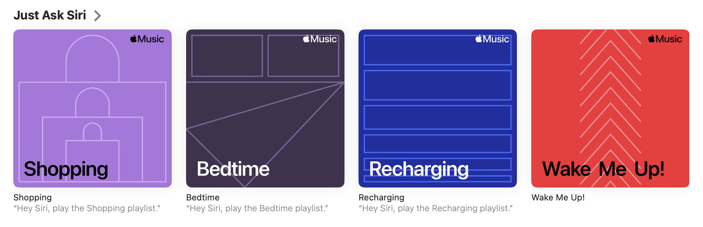

# Stacked

## Introduction

Stacked is a side project that I am working on. It's an app that recommends tv shows and movies. I always struggle to find something to watch at leisure. Stacked is a search engine. It finds movies and tv shows based on your mood, similar to "Just ask siri" in apple music.

<figure align="center">
  
</figure>

The blog posts by [vicki boykis](https://vickiboykis.com/2024/01/05/retro-on-viberary/) and [simon willison](https://simonwillison.net/2023/Jan/13/semantic-search-answers/) inspired me to build this project. I am building it to solidify my understanding of a production-grade system. I aim to build it end to end with minimal and clean code.

In this project, I will build a transformer-based machine learning search system. What I want here is semantic search - we want to find the movies and shows that match the meaning of the user's search term, even if the matching keywords are not present.

## Setup

## Architecture

## Training Data

## Model

## Indexing

## Lookup

## UI

## Production

## Resources

[1] [http://viberary.pizza/how](https://vickiboykis.com/2024/01/05/retro-on-viberary/)

[2] [Implement Semantic Search using Datasette](https://github.com/josephrmartinez/recipe-dataset/blob/main/tutorial.md)
